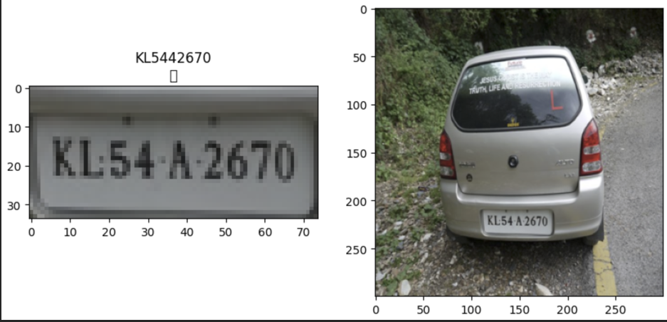

# License Plate Recognition

This model will receive an image as an input. Then it will return the license plate number.

This model will receive an image as an input. Then it will return the license plate number.
